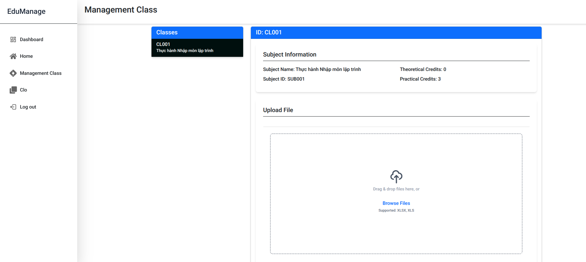
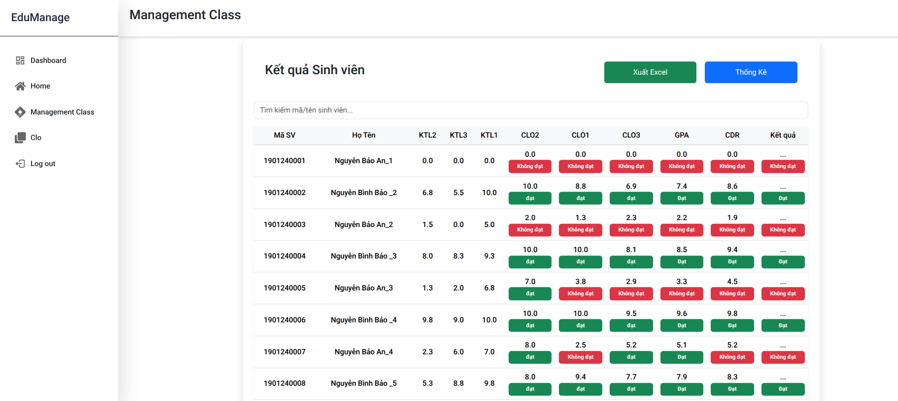
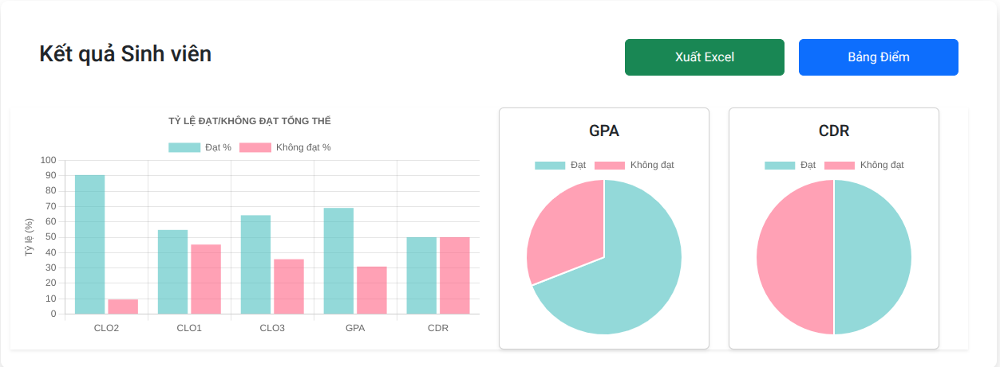

# Education Outcome Measurement System

## 1. Tổng quan
Hệ thống quản lý và đánh giá tự động Chuẩn đầu ra (CDR) cho ngành CNTT, bao gồm:

- Quản lý CLO (Course Learning Outcomes)
- Quản lý PLO (Program Learning Outcomes)  
- Phân tích kết quả học tập
- Xuất báo cáo thống kê

## 2. Kiến trúc hệ thống

### 2.1 Frontend
- React + TypeScript
- Bootstrap UI framework 
- Chart.js cho biểu đồ
- XLSX cho xuất Excel

### 2.2 Backend
- NestJS framework
- MySQL database
- Prisma ORM
- JWT authentication

### 2.3 Development
- Mock API server (JSON Server)

## Cấu trúc thư mục

```
DoLuong-CDR-CNTT/
├── front-end/
│   ├── public/            # Static files
│   ├── src/
│   │   ├── assets/        # Images, fonts, etc.
│   │   ├── components/    # Reusable components
│   │   ├── layouts/       # Layout components
│   │   ├── pages/         # Page components
│   │   ├── services/      # API services
│   │   ├── types/         # TypeScript types
│   │   └── utils/         # Helper functions
│   └── package.json       # Frontend dependencies and scripts
│
├── back-end/
│   ├── src/
│   │   ├── common/        # Shared utilities and constants
│   │   ├── config/        # Application configuration
│   │   ├── modules/       # Feature modules
│   │   ├── types/         # Type definitions
│   │   ├── utils/         # Helper functions
│   │   ├── app.module.ts  # Root module
│   │   └── main.ts        # Application entry point
│   └── package.json       # Backend dependencies and scripts
│
├── mock-api/              # JSON Server mock API
│   ├── db.json            # Mock data
│   └── package.json       # Mock API dependencies and scripts
│
└── README.md              # Project documentation
```

## 3. Tính năng chính

- Xác thực và kiểm soát truy cập dựa trên vai trò (Quản trị viên/Giảng viên)
- Quản lý lớp học và khóa học
- Đăng ký học viên và theo dõi điểm
- Đánh giá CLO/PLO tự động
- Phân tích và báo cáo điểm theo thời gian thực

## Với Admin

### Quản lý các Khoa và các Chương trình đào tạo

- Xóa/sửa Khoa hoặc các chương trình đào tạo
- Thêm/tạo mới 1 Khoa
- Thêm/tạo mới 1 hoặc nhiều chương trình đào tạo cho 1 Khoa

### Quản lý giảng viên

- Xóa/sửa giảng viên
- Thêm/tạo mới 1 hoặc nhiều giảng viên cho 1 Khoa

### Quản lý các học phần

- Xóa/sửa học phần
- Thêm/tạo mới 1 hoặc nhiều học phần cho 1 hoặc nhiều Khoa.
- Chọn giảng viên phụ trách học phần và giảng viên chủ nhiệm học phần

### Quản lý admin

- Thêm/xóa/sửa admin

### Quản lý PLO

- Thêm/xóa/sửa PLO cho 1 Khoa
- Thêm/xóa/sửa PLO con của PLO cha

### Quản lý lớp học

- Thêm/tạo mới 1 lớp học và giảng viên dạy lớp học đó

## Với giảng viên

### Quản lý lớp học

- Xem các lớp học mình dạy
- Upload file excel điểm
- Thống kê điểm của từng sinh viên

### Quản lý CLO

- Thêm CLO cha hoặc CLO con vào một CLO cha của một học phần
- Gán CLO vào một PLO

## 4. Cài đặt và chạy

### 4.1 Yêu cầu
- Node.js >= 20
- MySQL >= 9
- npm hoặc yarn

### 4.2 Environment Variables

```.env
DATABASE_URL=""
GLOBAL_PREFIX=""
ADMIN_PASS="add your admin pass for seeding database"
COOKIE_SECRET="T"
JWT_SECRET=""
JWT_EXPIRES_IN=""
```

### 4.3 Backend
```bash
cd back-end
npm install
npx prisma db push
npm run start:dev
```

### 4.4 Frontend
```bash  
cd front-end
npm install
npm run dev
```

## 5. Tài liệu API
Truy cập `/docs` sau khi chạy backend để xem tài liệu Swagger


## 6. [LICENSE](./LICENSE)
This project is UNLICENSED. Usage or redistribution is strictly prohibited unless authorized by the team.
